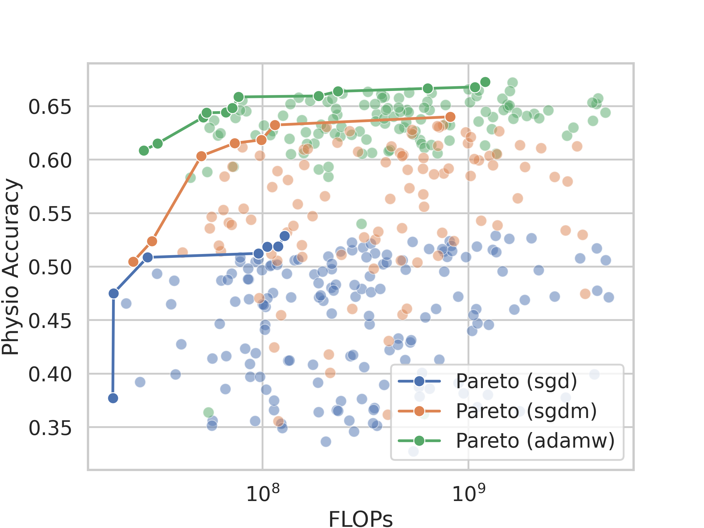
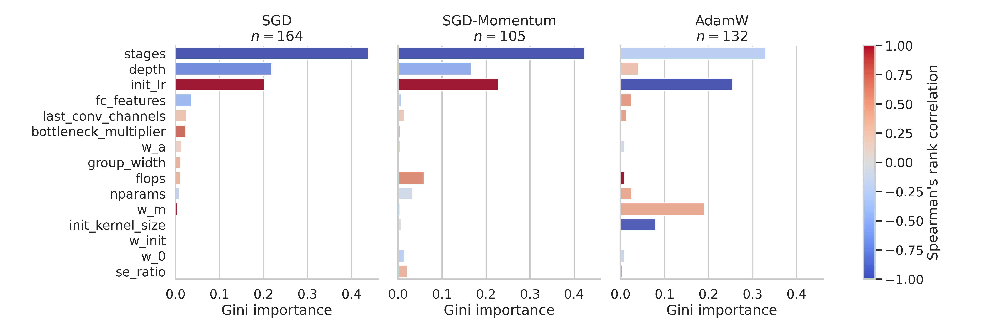

# Scaling Laws for NNs on ECG Data

## Introduction
This project aims to determine the scaling laws for the neural networks when applied to ECG (Electrocardiogram) data. Scaling laws help in understanding how the performance of a model changes with respect to its size, the amount of data, and available compute.

## News
This work has been accepted in the European Heart Journal – Digital Health (2025): **Learning to scale: deriving data-driven scaling laws for ECG-optimized CNNs**
- 👉 *Link to article (to be added)*

## Next Steps
- [ ] Extend the design space to include Transformer based models
- [ ] Use the learned scaling laws to scale models to larger sizes

## Results

### More compute leads to better performance
- Optimizer has a significant impact on performance and scaling capabilities
- Just using more compute does not improve performance. A careful choice of model architecture, optimizer, and hyperparamters is1 required.  

*Figure 1: Pareto front of model performance (Physionet Accuracy is a balanced accuracy described [here](https://physionet.org/content/challenge-2021/1.0.3/)) vs. total compute (FLOPs) for different optimizers. AdamW clearly outperforms SGD and SGD with Momentum.*

### Model architecture and scale predicts performance

*Figure 2: Random forest predicts perforamance based on hyperparameters. Shown are the regression plots for a 3-fold cross validation and the average pearson correlaction coeafficient.*

### Feature importance 
- Number of stages is consistently the most important hyperparameter
- AdamW is required to optimally use model large network width ($w_m$)
- SGD(-Momentum) does not work well with deep networks ($depth$). Use AdamW instead.

*Figure 3: Gini importance of scaling hyperparameters and their spearman rank correlation with Physionet Accuracy performance metric.*

### Inference benchmark

*Figure 3: Inference time benchmark on various hardware platforms and OpenVINO optimization levels. DML=Data Manipulation Language, GPU=NVIDIA A100, M4=Apple M4, AUTO=OpenVINO+Intel COREi7, CPU=Intel COREi7, NPU=Neural Processing Unit .*

## Dataset

We use the [PhysioNet 2021](https://physionet.org/content/challenge-2021/1.0.3/) dataset.
The dataset include >88.000 annotated twelve-lead ECG recordings from six sources in four countries across three continents.
1. CPSC Database and CPSC-Extra Database
2. INCART Database
3. PTB and PTB-XL Database
4. The Georgia 12-lead ECG Challenge (G12EC) Database
5. Chapman-Shaoxing and Ningbo Database
6. The University of Michigan (UMich) Database

## Model
We utilize the ConvNeXt model, a convolutional neural network architecture, known for its efficiency and performance in image and signal processing tasks.
Key features are:
- Stochastic depth
- LayerScale
- LayerNorm
- Inverted bottleneck
- GELU
- Depth wise convolution
- ... and more
